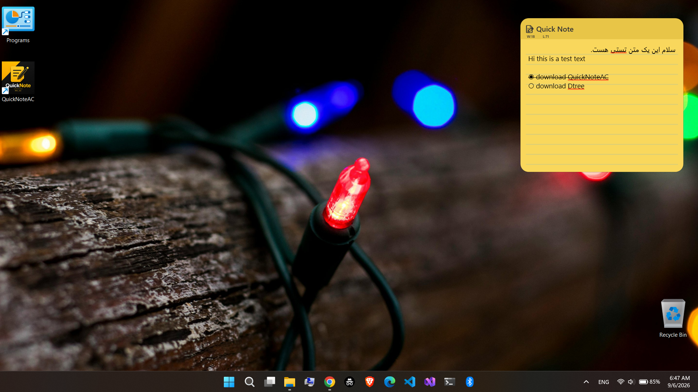
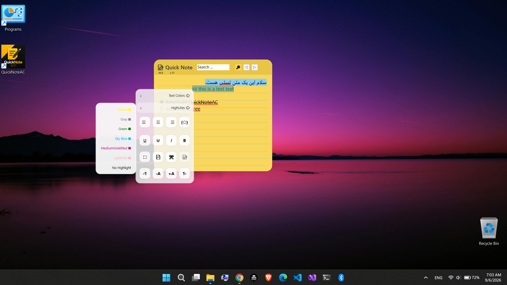
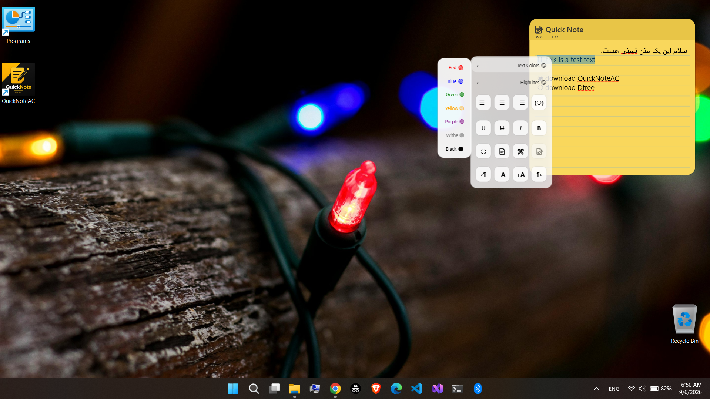

# ⚡ QuickNoteAC

> **سریع • سبک • ساده • خصوصی**

**QuickNoteAC** یک برنامه دسکتاپ سبک و سریع برای یادداشت‌برداری در **Windows** است.
تمرکز آن روی نوشتن سریع، ویرایش متن، جستجو و دسترسی آسان به یادداشت‌ها بدون پیچیدگی‌های اضافی است.

[**EN version**](https://github.com/ali-cheshomi/QuickNoteAC/blob/main/README.md)
---

## ✨ Features

* 📝 **Text Editor**

  * Bold / Italic / Underline / Strikethrough
  * تغییر اندازه و رنگ متن
  * Highlight
  * تراز چپ، وسط و راست
  * پشتیبانی از RTL / LTR
  * پشتیبانی از متن فارسی و انگلیسی

* 🔍 **Fast Search**

  * جستجوی سریع داخل یادداشت
  * پشتیبانی از فارسی، انگلیسی و Unicode
  * نمایش نتایج متعدد
  * نتیجه بعدی / قبلی
  * اسکرول خودکار به نتیجه
  * `Ctrl + F`

* 💾 **Auto Save**

  * ذخیره خودکار تغییرات
  * ذخیره دستی
  * بارگذاری خودکار هنگام اجرا
  * ذخیره اطلاعات به صورت محلی

* ☑️ **Checkbox**

  * ساخت چک‌لیست
  * تغییر وضعیت با دوبار کلیک
  * خط‌خوردن خودکار موارد تکمیل‌شده

* 🖥️ **Mini Mode**

  * پنجره کوچک و کم‌حجم
  * مناسب برای قرار گرفتن کنار سایر برنامه‌ها
  * امکان بازگشت سریع به حالت کامل

* 🔒 **Blur Mode**

  * مخفی کردن محتوای یادداشت
  * جلوگیری از ویرایش ناخواسته
  * بسته شدن خودکار Search هنگام فعال شدن

* 📌 **Always on Top**

  * نمایش QuickNoteAC روی سایر پنجره‌ها

* 📋 **Clipboard & Editing**

  * Copy / Cut / Paste
  * Undo / Redo
  * Select All

* 📊 **Word & Character Counter**

  * شمارش کلمات
  * شمارش کاراکترها بدون Whitespace

* 🖥️ **System Tray**

  * اجرای QuickNoteAC در Tray
  * Restore کردن برنامه
  * کنترل نمایش در Taskbar
  * خروج سریع از برنامه

---

## 🌍 Language Support

QuickNoteAC برای استفاده با متن‌های فارسی و انگلیسی طراحی شده است.

* 🇮🇷 فارسی
* 🇬🇧 English
* متن‌های ترکیبی فارسی و انگلیسی
* RTL / LTR
* Unicode

---

## ⌨️ Keyboard Shortcuts

| Shortcut   | Action                 |
| ---------- | ---------------------- |
| `Ctrl + F` | باز / بسته کردن Search |
| `Enter`    | انجام جستجو            |
| `Ctrl + C` | Copy                   |
| `Ctrl + X` | Cut                    |
| `Ctrl + V` | Paste                  |
| `Ctrl + Z` | Undo                   |
| `Ctrl + Y` | Redo                   |

---

## 📦 File Formats

| Format | Description            |
| ------ | ---------------------- |
| `.acn` | فرمت اختصاصی QuickNoteAC |
| `.txt` | خروجی متن ساده         |
| `*.*`  | انتخاب فایل‌های مختلف  |

همچنین امکان استفاده از **Save As** برای ایجاد نسخه جداگانه از یادداشت وجود دارد.

---

## ⚙️ Requirements

QuickNoteAC در دو نسخه ارائه می‌شود:

### .NET 8

برای نسخه **.NET 8**، نصب **.NET Desktop Runtime 8** موردنیاز است.

[Download .NET 8 Desktop Runtime — Microsoft](https://dotnet.microsoft.com/en-us/download/dotnet/8.0?utm_source=chatgpt.com)

### .NET 10

برای نسخه **.NET 10**، نصب **.NET Desktop Runtime 10** موردنیاز است.

[Download .NET 10 Desktop Runtime — Microsoft](https://dotnet.microsoft.com/en-us/download/dotnet/10.0?utm_source=chatgpt.com)

> **نکته:** اگر Runtime موردنیاز روی سیستم نصب نباشد، ممکن است QuickNoteAC اجرا نشود.

---

## 🔥 Getting Started

1. آخرین نسخه را از بخش **Releases** دانلود کنید.
2. فایل ZIP را Extract کنید.
3. نسخه موردنظر را انتخاب کنید.
4. در صورت نیاز، Runtime مربوط به همان نسخه .NET را نصب کنید.
5. `QuickNoteAC.exe` را اجرا کنید.
6. شروع به نوشتن کنید ✍️

> یادداشت ذخیره‌شده هنگام اجرای برنامه به صورت خودکار بارگذاری می‌شود.


---

## 🚀 اجرای خودکار هنگام شروع ویندوز

QuickNoteAC امکان **اجرای خودکار هنگام روشن شدن ویندوز** را نیز دارد.

این قابلیت **اختیاری** است و در صورت تمایل می‌توانید با قرار دادن یک Shortcut از `QuickNoteAC.exe` در پوشه Startup ویندوز، برنامه را به‌صورت خودکار اجرا کنید.

### 📁 مسیر پیش‌فرض Startup

برای باز کردن پوشه Startup می‌توانید کلیدهای `Win + R` را فشار دهید و عبارت زیر را وارد کنید:

```text
shell:startup
```

مسیر پیش‌فرض این پوشه:

```text
%APPDATA%\Microsoft\Windows\Start Menu\Programs\Startup
```

### ➕ اضافه کردن QuickNoteAC به Startup

برای اجرای خودکار QuickNoteAC هنگام ورود به ویندوز:

1. به محل `QuickNoteAC.exe` بروید.
2. روی فایل راست‌کلیک کرده و گزینه **Create shortcut** را انتخاب کنید.
3. Shortcut ساخته‌شده را در پوشه Startup کپی یا منتقل کنید.
4. ویندوز را مجدداً اجرا کنید تا QuickNoteAC به‌صورت خودکار اجرا شود.

> **نکته:** اضافه کردن QuickNoteAC به Startup الزامی نیست و کاملاً اختیاری است. در صورت تمایل می‌توانید برنامه را به‌صورت دستی اجرا کنید.

---

## 💾 Data Storage

اطلاعات اصلی یادداشت به صورت محلی روی سیستم ذخیره می‌شود و نیاز به اینترنت ندارد.

برای استفاده معمول از QuickNoteAC نیازی به حساب کاربری یا اتصال به سرویس آنلاین نیست.

---

## 🖼️ Screenshots







---

## 🐛 Bug Reports

اگر با مشکلی مواجه شدید، لطفاً یک **Issue** ایجاد کنید و اطلاعات زیر را در آن قرار دهید:

* Windows Version
* QuickNoteAC Version
* Steps to Reproduce
* Expected Behavior
* Actual Behavior
* Screenshot / Screen Recording

---

## 💡 Feature Requests

ایده‌ای برای بهتر شدن QuickNoteAC دارید؟

یک **Feature Request** ایجاد کنید و توضیح دهید:

* چه قابلیتی نیاز دارید؟
* چرا این قابلیت مفید است؟
* قابلیت چگونه باید کار کند؟
* آیا نمونه مشابهی وجود دارد؟

---

## 🗺️ Roadmap

برخی قابلیت‌های احتمالی نسخه‌های آینده:

* 🎨 امکانات بیشتر برای قالب‌بندی
* 🌓 Themeهای بیشتر
* ⚙️ پنل Settings
* ⌨️ میانبرهای بیشتر
* 🔍 بهبود Search
* 📂 مدیریت بهتر فایل‌ها
* 📄 فرمت‌های خروجی بیشتر
* 🎨 بهبود رابط کاربری
* ⚡ بهبود Performance

> Roadmap ممکن است در طول توسعه پروژه تغییر کند.

---

## 🔐 Privacy

QuickNoteAC در درجه اول یک برنامه **Local** است.

یادداشت‌های کاربر روی کامپیوتر ذخیره می‌شوند و برای استفاده معمول نیازی به حساب آنلاین نیست.

---

## 🔒 License

**QuickNoteAC is Proprietary / Closed Source.**

Copyright © 2026 **MRACco / MRAC / MR_AC / Ali Chechomi**

All rights reserved.

Source code, binaries, branding, design and related assets are proprietary and may not be copied, modified, redistributed, repackaged, reverse engineered or commercially used without prior written permission from the copyright holder.

> این Repository برای انتشار نسخه‌ها، مستندات، گزارش مشکلات و Feature Request استفاده می‌شود.

---

## ❤️ About

QuickNoteAC با یک هدف ساده ساخته شده است:

> **سریع بنویس. متمرکز بمان. یادداشت‌هایت را همیشه در دسترس داشته باش.**

ساخته‌شده با ❤️ توسط **MRAC**

---

<div align="center">

### ⚡ QuickNoteAC

**Fast • Lightweight • Simple • Private**

Copyright © 2026 MRACco / MRAC / MR_AC / Ali Chechomi

**All rights reserved.**

</div>
